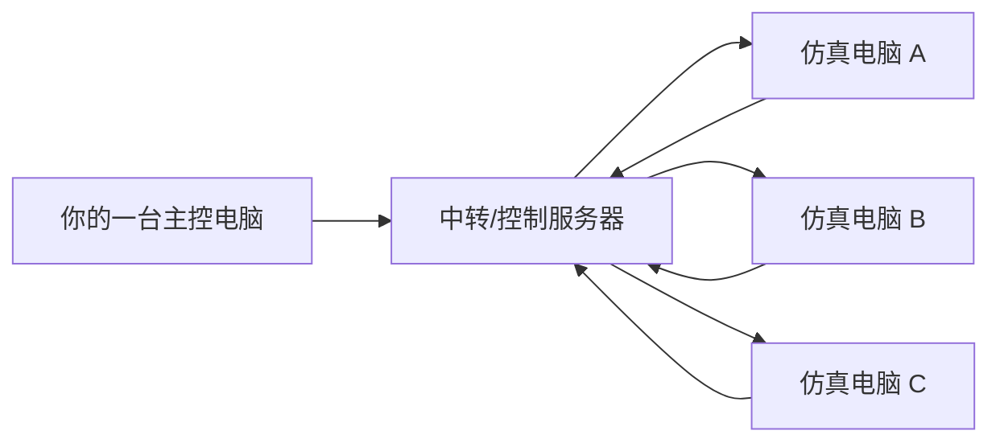
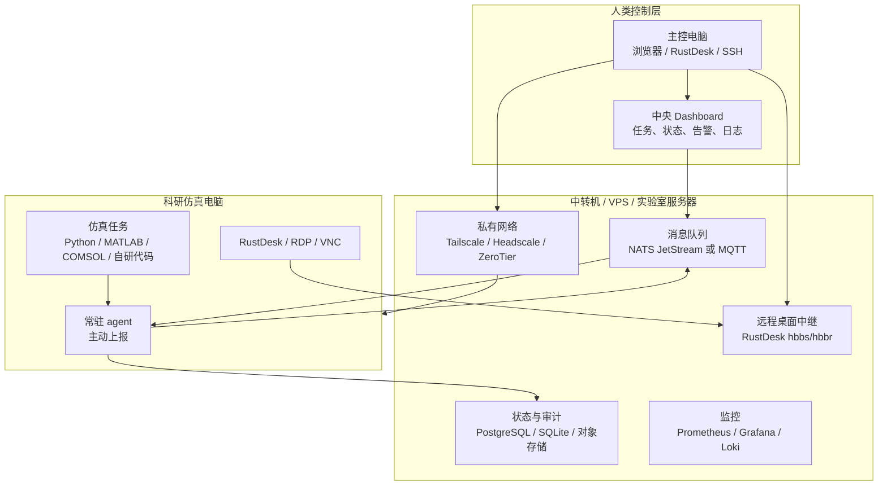
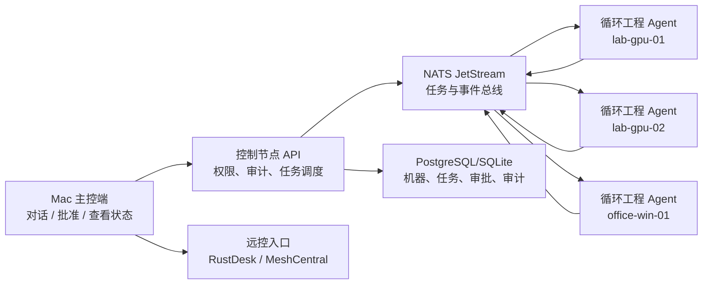
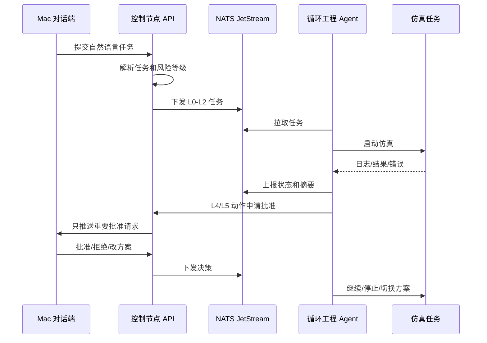
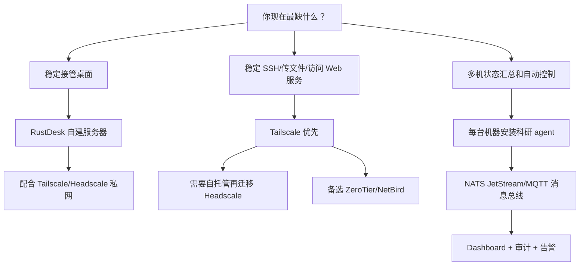

# 多电脑科研仿真远控与 Agent 中转方案调研

> 调研日期：2026-06-15  
> 目标读者：需要长期管理多台科研/仿真电脑的研究生  
> 核心约束：校园网 IP 会变化、NAT/防火墙不可控、ToDesk 等商业远控不稳定、未来需要让多台机器上的 agent 主动汇报状态并接受统一控制。

## 当前仓库状态

这个仓库现在已经包含 Stage A 原型：一台新机器可以通过 bootstrap token 注册成 worker，向 Mac 控制中心发送 heartbeat，把 Codex/Claude Code/Agent 的状态报告推回 Mac，并通过 worker chat 读取/回复自己的 Mac 对话线程。后续会在这个基础上接入 EvoScientist job runner、云服务器自动租赁和科研数据飞轮。

当前架构决策：

```text
Mac = 唯一主机 / 控制端 / 人类操作台
Linux worker = 被添加的科研/仿真机器
Windows worker = 被添加的科研/仿真机器
VPS / Tailscale / RustDesk = 网络与远控兜底，不是第二个主控
```

当前代码结构：

```text
control/     最小控制中心 API，保存 worker、job、report、chat、approval、audit
agent/       EvoScientist worker wrapper 的最小外壳：注册、heartbeat、上报、worker chat、审批请求
farmctl/     Mac 侧 CLI：创建 token、列 worker、创建 job、查看 report/chat、生成安装命令
install/     Linux/Windows worker 一键安装脚本，自动复制上报 skill；macOS worker 为备用
apps/        轻量控制台 UI，由 control server 直接托管，支持按 worker 切换对话框
infra/       Docker、Compose、systemd、cloud-init 模板
skills/      Codex skill：把 Codex/Claude Code 状态推回 Mac
.claude/     Claude Code 项目级 skill 和 /loop-farm-mac 命令：让 Claude Code 直接和 Mac 交互
examples/    示例机器清单、worker 配置、job payload
tests/       最小单元测试
scripts/     smoke 测试脚本
```

快速验证：

```bash
make pycheck
make test
make smoke
```

更详细的 Stage A 使用说明见 [QUICKSTART_STAGE_A.md](./QUICKSTART_STAGE_A.md)。
一体化安装和三端 worker 安装流程见 [INSTALLATION.md](./INSTALLATION.md)。
Codex/Claude Code 上报通道见 [CODEX_CLAUDE_REPORTING.md](./CODEX_CLAUDE_REPORTING.md)。
Windows 已安装 Claude Code 时，优先用 [WINDOWS_CLAUDE_BOOTSTRAP.md](./WINDOWS_CLAUDE_BOOTSTRAP.md)：Mac 生成一次性部署提示词，Windows Claude Code 本机完成安装、注册、验证和上报。
注册完成后，Windows/Linux 上的 Claude Code 可以在仓库里直接用 `/loop-farm-mac pull|health|report|reply|approval` 和 Mac 控制端交互。

## 1. 先给结论

不要从零开始复刻一个完整的 ToDesk。远程桌面的图形采集、输入注入、NAT 穿透、加密、重连、权限隔离都很复杂，自研成本远高于直接组合成熟组件。

推荐把系统拆成三层：

1. **私有网络/穿透层**：解决“机器在哪里、IP 变不变、能不能连上”的问题。
2. **远程桌面/终端层**：解决“人如何临时接管某台机器”的问题。
3. **科研 Agent 控制层**：解决“机器如何主动汇报、自动执行、只在必要时请求人类”的问题。

最实用的路线：

| 阶段 | 推荐方案 | 适合目标 |
| --- | --- | --- |
| 现在立刻能用 | **Tailscale + RustDesk 自建服务器 + SSH/RDP/VNC** | 快速稳定接入多台机器，减少 ToDesk 掉线影响 |
| 想尽量自托管 | **Headscale + 自建 DERP/中转 + RustDesk + MeshCentral** | 不依赖商业控制平面，适合长期实验室基础设施 |
| 后续 agent 化 | **NATS JetStream/MQTT + 中央控制台 + 每台机器常驻 agent** | 让所有仿真机器主动推送进度、日志、异常和待决策请求 |

如果只能选一个短期方案：**先上 Tailscale 组网，再自建 RustDesk Server 做图形远控**。Tailscale 负责稳定寻址和内网互通，RustDesk 负责像 ToDesk 一样接管桌面。后面再逐步把“人肉远控”替换为 agent 自动上报和任务队列。

## 2. 你的场景抽象

你现在遇到的问题不是单纯“缺一个远控软件”，而是一个小型分布式科研集群的早期形态：



关键设计原则：

1. **所有科研电脑主动连出去**：校园网 IP 变化或 NAT 严格时，入站连接最脆弱；让每台机器主动连接中转机或控制平面会稳定很多。
2. **人类请求是稀缺资源**：不要让每台 agent 随时打断你；agent 应该先本地处理、汇总、降噪，只把“需要你判断”的问题推送到主控电脑。
3. **远控只作为兜底**：日常应该通过任务队列、日志、状态面板、文件同步解决，只有环境异常、GUI 软件必须交互时才接管桌面。
4. **中转机要可寻址**：如果中转机也在校园网且没有公网 IP，那么还需要一个 VPS、Tailscale/ZeroTier/NetBird 这类控制平面，或者自建 DERP/relay。

## 3. 推荐总体架构



### 3.1 长期维护的最简架构

你的新目标可以压缩成一句话：

> 只在 Mac 上对话，由一个稳定控制节点调度所有电脑；每台电脑安装循环工程 agent，agent 默认自动处理低风险任务，只把高风险、高价值、不可逆的问题推给你批准。

长期维护时，不建议让 Mac 直接管理所有机器。Mac 会休眠、断网、换网络，也不适合承担消息队列和审计数据库。更稳的结构是：



角色边界：

| 角色 | 应该做什么 | 不应该做什么 |
| --- | --- | --- |
| Mac 主控端 | 对话、批准、发起任务、查看汇总、必要时远控 | 不长期保存唯一状态，不作为唯一中转，不承担所有机器心跳 |
| 控制节点 | API、消息队列、数据库、审计、调度、权限策略 | 不跑重型仿真，不把所有服务裸露公网 |
| 工作机 agent | 主动连回控制节点、执行任务、上报状态、申请批准 | 不接受公网入站控制，不私自执行高风险命令 |
| RustDesk/MeshCentral | 人类兜底接管桌面、终端、文件 | 不作为科研任务编排系统 |

最小可维护组合：

```text
Mac 主机:
  - Control server
  - 浏览器 Dashboard
  - 一个对话入口：CLI / Web Chat / 本地 Mac App
  - RustDesk 客户端

控制节点:
  - Tailscale，后续可换 Headscale
  - Docker Compose
  - NATS JetStream
  - PostgreSQL，早期也可 SQLite
  - 控制 API + Dashboard
  - RustDesk Server 或 MeshCentral

每台 Linux/Windows 工作机:
  - Tailscale
  - RustDesk 或 MeshCentral Agent
  - 循环工程 agent
  - 只给 agent 必要的本地权限
```

### 3.2 Mac 端对话控制模型

Mac 端应该是“人类操作台”，不是“超级 root 跳板”。推荐交互模式：

```text
你在 Mac 上输入：
  “把 lab-gpu-01 到 lab-gpu-04 的昨天失败任务重跑，优先用空闲 GPU，失败后只汇报摘要。”

Mac 对话端做：
  1. 把自然语言请求发给控制 API。
  2. 控制 API 解析成任务计划。
  3. 系统估算风险级别。
  4. 低风险任务直接下发。
  5. 高风险任务生成批准请求。
  6. agent 执行并持续上报。
  7. 只有 blocked/needs_human 事件回到 Mac。
```

Mac 端可以有三种实现方式，按简单到复杂排序：

| 方式 | 说明 | 推荐阶段 |
| --- | --- | --- |
| Web Dashboard + Chat 输入框 | 浏览器打开控制节点页面，所有命令从页面发出 | 第一版最推荐 |
| CLI：`farmctl` | 在 Mac 终端对话和批准，例如 `farmctl ask "..."` | 适合你自己高频使用 |
| 原生 Mac App | 菜单栏常驻、通知、批准弹窗 | 后期再做 |

第一版不要急着做复杂 Mac App。**先做 Web Dashboard + CLI**，长期更容易维护，也更容易从手机或其他电脑应急访问。

### 3.3 权限分级与批准策略

“尽可能调度所有电脑的一切权限”不能等价于“agent 永远无条件 root/admin”。长期维护时，应该给 agent 分层权限：

| 权限级别 | agent 是否可自动执行 | 示例 | 是否需要你批准 |
| --- | --- | --- | --- |
| L0 只读状态 | 是 | 查看 CPU/GPU/内存/磁盘、读取任务状态 | 否 |
| L1 工作目录内操作 | 是 | 创建任务目录、写日志、压缩结果、上传 artifact | 否 |
| L2 安全任务控制 | 是 | 启动/停止自己创建的仿真任务、重试失败任务 | 通常否 |
| L3 受控系统操作 | 条件执行 | 安装白名单依赖、重启 agent 服务、清理缓存 | 需要策略允许；首次建议批准 |
| L4 高风险操作 | 否，必须申请 | 删除大目录、重启电脑、改网络、防火墙、改 sudo/admin 权限 | 必须批准 |
| L5 人类远控 | 只能请求 | 打开 GUI 检查、处理登录/验证码/许可证异常 | 必须批准 |

批准规则建议：

1. 默认自动批准 L0-L2。
2. L3 需要白名单，例如只允许安装指定 Python 包、重启指定服务。
3. L4-L5 必须进入 `needs_human` 队列。
4. 同类请求合并，不允许 10 台机器问 10 次同一个问题。
5. 你的批准可以带作用域，例如“只批准 lab-gpu-01，本次任务有效，30 分钟内有效”。
6. 所有批准都写入审计日志，后续 agent 遇到同类情况可引用历史决策，但不能自动扩大权限。

### 3.4 循环工程 Agent 的最小能力

每台电脑后面装的循环工程 agent，第一版不需要很大。它只要稳定做到下面这些事，就已经能替代大量人工远控：

```text
必须有:
- heartbeat：我还活着
- inventory：我是什么机器，有什么 CPU/GPU/内存/磁盘/系统
- metrics：当前资源占用
- job runner：在指定工作目录启动/停止/查看任务
- log tail：截取关键日志并摘要
- artifact uploader：上传结果、图片、表格、压缩包
- approval client：向控制节点申请高风险动作批准
- local state：断网/重启后能恢复任务状态

暂时不要做:
- 通用 root shell
- 任意公网端口暴露
- 自动修改系统网络
- 自动删除未知目录
- 自研远程桌面
```

Agent 和控制节点的关系：



### 3.5 最推荐的第一版实现

第一版目标：简单、可维护、能长期扩展。

```text
网络:
  Tailscale

远控兜底:
  RustDesk 自建 Server
  可选 MeshCentral

控制节点:
  Docker Compose
  NATS JetStream
  SQLite 或 PostgreSQL
  FastAPI 控制 API
  简单 Web Dashboard

Mac:
  浏览器 Dashboard
  farmctl CLI
  RustDesk 客户端

工作机:
  循环工程 agent
  Tailscale
  RustDesk/MeshCentral Agent
```

第一版不要上太多东西：

1. 不急着 Headscale，先 Tailscale。
2. 不急着 Kubernetes，Docker Compose 足够。
3. 不急着复杂前端，先把任务、机器、批准队列跑通。
4. 不急着自研远控，RustDesk/MeshCentral 兜底。
5. 不急着“所有权限全开放”，先把权限分级和审计做好。

## 4. 方案对比总表

评分含义：5 = 很适合，1 = 不适合。分数是面向“多台科研电脑、校园网动态 IP、需要未来 agent 化”的主观工程评分。

| 方案 | 类型 | NAT/动态 IP | 图形远控 | 终端/文件 | 多机管理 | 自托管 | 安全可控 | 上手难度 | 综合建议 |
| --- | --- | ---: | ---: | ---: | ---: | ---: | ---: | ---: | --- |
| Tailscale + RustDesk | 组合方案 | 5 | 5 | 5 | 4 | 3 | 4 | 2 | **最推荐起步** |
| Headscale + RustDesk | 组合方案 | 4 | 5 | 5 | 4 | 5 | 4 | 4 | 适合长期自托管 |
| ZeroTier + RustDesk/RDP | 组合方案 | 4 | 4 | 4 | 4 | 3 | 4 | 2 | Tailscale 替代品 |
| NetBird + RustDesk/RDP | 组合方案 | 4 | 4 | 4 | 4 | 4 | 4 | 3 | WireGuard 管理平台替代 |
| RustDesk 自建服务器 | 远控 | 4 | 5 | 3 | 3 | 5 | 4 | 2 | 替代 ToDesk 的核心组件 |
| MeshCentral | 远程管理平台 | 4 | 4 | 4 | 5 | 5 | 4 | 3 | 很适合实验室多机管理 |
| Apache Guacamole + VPN | 浏览器网关 | 2 | 3 | 4 | 4 | 5 | 4 | 3 | 适合浏览器集中入口 |
| FRP + RDP/VNC/SSH | 反向代理 | 4 | 3 | 4 | 2 | 5 | 2 | 3 | 可用但要非常注意安全 |
| Cloudflare Tunnel | 零信任隧道 | 4 | 2 | 3 | 3 | 2 | 4 | 2 | 适合 Web/SSH，不是完整 ToDesk 替代 |
| 完全从零自研远控 | 自研 | 2 | 1 | 2 | 2 | 5 | 2 | 5 | 不建议；只建议自研 agent 控制层 |

## 5. 各方案详细分析

### 5.1 RustDesk 自建服务器

RustDesk 是最接近 ToDesk 使用体验的开源远程桌面方案。它支持自建 server，核心进程通常是：

| 组件 | 作用 |
| --- | --- |
| `hbbs` | ID/rendezvous server，帮助客户端发现和建立连接 |
| `hbbr` | relay server，直连失败时转发远程桌面流量 |

RustDesk 官方自建文档说明，默认需要开放 `21115-21119/TCP` 和 `21116/UDP`，其中 `21117/TCP` 常用于 relay 服务，`21116` 同时用于 TCP 打洞和 UDP 心跳/ID 服务。

优点：

1. 使用体验最像 ToDesk，适合 GUI 软件、Windows 桌面、临时排查。
2. 可以自建中继，降低商业远控不可控因素。
3. 支持无人值守访问，适合实验室机器长期在线。
4. 和 Tailscale/Headscale 搭配后，即使校园网 IP 变化，也能稳定找到机器。

缺点：

1. 它解决的是“远程接管”，不是“科研任务编排”。
2. 多机状态、日志、任务进度、告警还需要另外做。
3. 如果中转服务器本身没有稳定公网入口，仍然需要 VPN/隧道/VPS。

适合你的用法：

1. 在中转机或 VPS 上部署 `hbbs/hbbr`。
2. 每台科研电脑安装 RustDesk 客户端，配置自建 ID server/relay server。
3. 对关键机器开启无人值守，但配合强密码、白名单和系统登录权限。
4. 日常不用它跑任务，只在必须看 GUI 或修环境时使用。

### 5.2 Tailscale

Tailscale 是基于 WireGuard 的组网工具。它把多台机器组成一个私有 tailnet，机器的校园网 IP 怎么变都不重要，只要能访问互联网并登录同一个 tailnet，就能通过稳定的 Tailscale IP/机器名互通。Tailscale 在直连失败时会使用 DERP relay 作为兜底。

优点：

1. 对校园网动态 IP/NAT 很友好，安装后机器主动加入网络。
2. 可以直接 SSH、RDP、VNC、访问 Web Dashboard、访问 Jupyter/Gradio/仿真服务。
3. ACL、设备身份、用户身份管理比较成熟。
4. 上手很快，适合作为第一阶段基础网络。

缺点：

1. 默认控制平面是 Tailscale 官方服务，不是完全自托管。
2. 免费/付费计划的设备数、用户数、功能会随官方政策变化，需要以官网为准。
3. 如果你对数据和控制平面有强自托管要求，需要考虑 Headscale 或其他替代。

适合你的用法：

1. 所有科研电脑装 Tailscale。
2. 主控电脑也装 Tailscale。
3. 远程终端直接走 `ssh user@machine-name` 或 Tailscale SSH。
4. RustDesk/Guacamole/MeshCentral 的服务端也只在 Tailscale 私网内暴露，减少公网攻击面。

### 5.3 Headscale

Headscale 是 Tailscale 控制服务器的开源自托管实现。它适合你未来想把控制权收回到自己服务器上的场景。

优点：

1. 控制平面自托管，长期更可控。
2. 仍然可以使用 Tailscale 客户端加入网络。
3. 适合实验室/课题组内部搭建私有网络。

缺点：

1. 部署和维护复杂度高于官方 Tailscale。
2. DERP/relay、证书、域名、用户管理、备份都要自己维护。
3. 你需要有一台稳定可访问的公网服务器，或者至少有稳定入口。

建议：

短期先用 Tailscale 验证流程。等你管理的机器超过几台、流程稳定后，再迁移到 Headscale。不要一开始就把网络层复杂度拉满。

### 5.4 ZeroTier

ZeroTier 也是常见的虚拟组网方案。它与 Tailscale 类似，也能让多台机器在 NAT 后组成虚拟局域网。

优点：

1. 使用简单，多平台支持好。
2. 适合把 Windows、Linux、macOS 混合组网。
3. 可以作为 Tailscale 的替代或备份。

缺点：

1. 权限模型和 ACL 使用体验与 Tailscale 不同，需要实际试用比较。
2. 免费层设备数量、管理功能需要以官网当前政策为准。
3. 完全自托管和可观测性通常不如自己掌控的 Headscale/NetBird 方案清晰。

适合你的用法：

如果 Tailscale 在校园网环境下表现不稳定，可以试 ZeroTier。它不直接替代 RustDesk，而是替代“私有网络层”。

### 5.5 MeshCentral

MeshCentral 是一个自托管的 Web 远程管理平台。每台机器安装 agent 后，会主动连接 MeshCentral Server；你可以在浏览器里远程桌面、终端、传文件、管理多台设备。

优点：

1. 很符合“所有机器主动连到一台中心服务器”的模式。
2. Web 控制台天然适合多机管理。
3. 远程桌面、终端、文件管理在一个系统里。
4. 自托管程度高，适合实验室长期使用。

缺点：

1. 远程桌面体验通常不如专门的 RustDesk/Parsec/ToDesk。
2. 自建服务端要做好 HTTPS、账号权限、备份、安全更新。
3. 对高帧率 GUI 或复杂图形软件，体验可能一般。

适合你的用法：

MeshCentral 很适合做“实验室设备管理总后台”。即使你最终用 RustDesk 接管桌面，也可以用 MeshCentral 看在线状态、进终端、传文件、执行维护命令。

### 5.6 Apache Guacamole

Apache Guacamole 是“浏览器里的远程桌面网关”。它本身不要求客户端装专用软件，但后端通常需要能连到目标机器的 RDP/VNC/SSH。

优点：

1. 只用浏览器即可访问 RDP/VNC/SSH。
2. 适合把多台机器的入口统一成一个 Web 门户。
3. 自托管，权限集中。

缺点：

1. 它不是 NAT 穿透工具；Guacamole Server 必须能访问目标机器。
2. 更适合配合 Tailscale/Headscale/ZeroTier 使用。
3. 图形性能和易用性通常不如专门远控。

适合你的用法：

在中转机上部署 Guacamole，让 Guacamole 通过 Tailscale 私网访问各机器的 RDP/VNC/SSH。这样你在主控电脑打开一个网页就能进多台机器。

### 5.7 FRP

FRP 是高性能反向代理工具，常用于把内网机器的 SSH/RDP/Web 服务反向暴露到一台公网服务器。

优点：

1. 轻量、直接、可自托管。
2. 适合把某台机器的某个端口临时暴露出来。
3. 对动态 IP/NAT 友好，因为内网机器主动连 FRP server。

缺点：

1. 它只是隧道，不是完整权限系统。
2. 如果直接暴露 RDP/VNC/SSH 到公网，风险很高。
3. 多机、多用户、审计、权限、密钥轮换都要自己设计。

适合你的用法：

FRP 可以作为备用通道，例如临时暴露某台机器的 Jupyter、SSH 或 Web UI。但不建议把它作为长期唯一方案，更不建议裸露 RDP/VNC 到公网。

### 5.8 Cloudflare Tunnel

Cloudflare Tunnel 让内网服务通过 `cloudflared` 主动连到 Cloudflare，再由 Cloudflare Access 统一鉴权。它适合 Web 服务、SSH、部分 TCP 场景。

优点：

1. 不需要公网 IP。
2. 对 Web Dashboard、Jupyter、内部工具很方便。
3. 可以用 Cloudflare Access 做身份验证。

缺点：

1. 不是完整远程桌面替代。
2. 对 RDP/VNC 这类图形交互不是最自然的方案。
3. 依赖 Cloudflare 账号、域名和其服务策略。

适合你的用法：

把中央 Dashboard、JupyterHub、Grafana 暴露给自己访问可以考虑它；远程桌面仍建议 RustDesk/MeshCentral/Guacamole。

## 6. 决策树



## 7. 建议落地路线

### 第 0 步：明确中转机位置

中转机有三种情况：

| 中转机类型 | 可行性 | 说明 |
| --- | --- | --- |
| 有公网 IP 的 VPS | 最推荐 | 最稳定，适合跑 RustDesk Server、Headscale、NATS、Dashboard |
| 实验室固定电脑但无公网 IP | 可用但要补穿透 | 它也需要 Tailscale/ZeroTier/Cloudflare Tunnel 或反向连 VPS |
| 你的个人电脑 | 不建议作为唯一中转 | 关机、休眠、换网都会影响所有机器 |

如果你说“有专门一台电脑可以做中转”，需要确认它是否有公网可访问入口。如果没有，建议再配一个便宜 VPS 作为真正的公网入口；那台专门电脑可以做数据/计算/内网管理节点。

### 第 1 步：先搭私有网络

推荐顺序：

1. 所有机器安装 Tailscale。
2. 给机器命名，例如 `lab-gpu-01`、`lab-cpu-02`、`office-win-01`。
3. 主控电脑加入同一个 tailnet。
4. 测试：
   - `ping lab-gpu-01`
   - `ssh lab-gpu-01`
   - 打开 `http://lab-gpu-01:端口`
5. 设置 ACL：主控电脑和中转机可以访问所有科研电脑；科研电脑之间默认不要互相全通。

短期不要纠结 Headscale。先验证“机器都能稳定连上、机器名稳定、SSH/Web 服务稳定”。

### 第 2 步：部署 RustDesk 自建远控

部署位置：

1. 最好放在有公网 IP 的 VPS。
2. 如果 RustDesk 只给 Tailscale 内部使用，也可以只监听 Tailscale 私网地址。
3. 如果必须公网访问，务必限制防火墙、开启密钥校验、做好更新。

开放端口参考：

| 端口 | 协议 | 用途 |
| --- | --- | --- |
| 21115 | TCP | NAT type test |
| 21116 | TCP/UDP | ID registration、TCP hole punching、UDP heartbeat |
| 21117 | TCP | Relay |
| 21118 | TCP | Web client support |
| 21119 | TCP | Web client support |

每台科研电脑：

1. 安装 RustDesk。
2. 配置自建 ID Server 和 Relay Server。
3. 记录设备 ID。
4. 设置强密码/无人值守访问。
5. 给系统账号本身也设置强密码，不要只依赖远控密码。

### 第 3 步：补一个多机管理面板

候选：

1. **MeshCentral**：一体化远程管理，推荐先试。
2. **Guacamole**：统一浏览器入口，适合已有 RDP/VNC/SSH。
3. **Grafana + Prometheus + Loki**：用于监控、日志、告警。

建议：

如果你经常需要“看哪台机器在线、进终端、传文件、点开桌面”，先上 MeshCentral。  
如果你主要需要“所有服务都在浏览器里进”，再加 Guacamole。

### 第 4 步：做科研 Agent 控制层

这是你后面真正需要自研的部分。

每台科研电脑跑一个常驻 agent，agent 只主动连接中转机，不等待别人连进来。

Agent 职责：

1. 上报机器状态：CPU/GPU/内存/磁盘/温度/在线状态。
2. 上报任务状态：排队、运行、完成、失败、需要人工判断。
3. 上传关键日志和结果摘要。
4. 接收中央控制台下发的任务。
5. 本地保存任务状态，断网后恢复上报。
6. 对“危险命令”做白名单和二次确认。

消息总线选择：

| 方案 | 优点 | 缺点 | 建议 |
| --- | --- | --- | --- |
| NATS JetStream | 轻量、高性能、支持持久化 stream、适合任务事件 | 需要自己设计 topic 和权限 | **推荐** |
| MQTT/Mosquitto | IoT 生态成熟，发布订阅简单 | 复杂任务编排能力较弱 | 适合简单状态上报 |
| Redis Streams | 上手快，和 Web 后端好集成 | 长期消息系统语义不如专业 MQ 清晰 | 小规模可以 |
| RabbitMQ | 功能完整，路由能力强 | 运维稍重 | 任务复杂时可考虑 |
| 直接 HTTP polling | 最简单 | 实时性、可靠性、扩展性一般 | 原型阶段可用 |

推荐 topic 设计：

```text
agents.<machine_id>.heartbeat
agents.<machine_id>.metrics
agents.<machine_id>.logs
agents.<machine_id>.events
jobs.<machine_id>.submit
jobs.<machine_id>.cancel
jobs.<machine_id>.result
human.requests.pending
human.requests.resolved
```

“人类请求稀缺”的机制：

1. agent 先把错误分级：`info`、`warning`、`blocked`、`needs_human`。
2. 同类错误合并，例如 10 台机器同一个依赖失败，只推一条汇总。
3. 每个请求必须包含：
   - 发生机器
   - 当前任务
   - 失败日志摘要
   - agent 已尝试的修复
   - 建议的 2-3 个可选动作
   - 默认推荐动作
4. 主控电脑只显示 `needs_human` 队列。
5. 你做出决策后，系统把决策广播给相关 agent，避免重复问。

## 8. 安全策略

最低安全要求：

1. 不要把 Windows RDP、VNC、SSH 直接裸露到公网。
2. 所有公网入口必须使用强认证，最好 MFA。
3. 每台机器使用独立身份，不共享万能密码。
4. 中转机上所有服务都要有自动备份和更新计划。
5. agent 下发命令必须有审计日志。
6. 危险操作需要二次确认，例如删除数据、停止所有任务、重启机器、安装系统包。
7. 科研数据和控制命令分开授权，不要让“查看状态”的 token 能执行命令。
8. 给每台机器贴标签：`gpu`、`cpu`、`windows`、`linux`、`critical`、`temporary`。
9. 默认最小权限：主控机能访问工作机，工作机之间不默认互相访问。

建议网络暴露策略：

| 服务 | 暴露范围 |
| --- | --- |
| RustDesk Server | 公网或 Tailscale 私网；如果公网暴露需严格防火墙 |
| MeshCentral | 只在 Tailscale 私网或 Cloudflare Access 后面 |
| Guacamole | 只在 Tailscale 私网或 Cloudflare Access 后面 |
| NATS/MQTT | 只允许 agent 和 Dashboard 访问，使用 TLS/token/mTLS |
| Grafana | 只给主控机访问 |
| SSH/RDP/VNC | 只在私有网络内访问 |

## 9. 推荐技术栈

### 短期可用版

```text
Tailscale
+ RustDesk Server
+ SSH
+ Syncthing/rsync/rclone
+ 简单状态脚本
```

用途：

1. 解决远控掉线。
2. 解决动态 IP。
3. 解决多机器 SSH/文件同步。

### 实验室稳定版

```text
Tailscale 或 Headscale
+ RustDesk Server
+ MeshCentral
+ Guacamole
+ Prometheus + Grafana + Loki
+ 定期备份
```

用途：

1. 多机器可视化管理。
2. 浏览器统一入口。
3. 机器状态、日志、告警集中化。

### Agent 自动化版

```text
Headscale/Tailscale
+ RustDesk Server
+ NATS JetStream
+ FastAPI 控制后端
+ PostgreSQL
+ React/Vue Dashboard
+ 每台机器 Python/Go agent
+ Prometheus/Grafana/Loki
```

用途：

1. 所有 agent 主动推送信息。
2. 任务自动调度、失败自动恢复。
3. 人类只处理高价值决策。

## 10. 一个最小可行系统设计

### 10.1 节点角色

| 角色 | 数量 | 职责 |
| --- | --- | --- |
| 主控电脑 | 1 | 你日常使用，打开 Dashboard/RustDesk/SSH |
| 公网入口 VPS | 1 | 域名、TLS、RustDesk relay、可选 Headscale/DERP |
| 中转/控制服务器 | 1 | NATS、Dashboard、数据库、监控 |
| 科研工作机 | N | 跑仿真、跑 agent、提供远程桌面 |

如果中转/控制服务器本身就是公网 VPS，可以合并“公网入口 VPS”和“中转/控制服务器”。

### 10.2 每台工作机安装内容

Linux 工作机：

```text
tailscale
rustdesk
openssh-server
node_exporter
科研 agent
tmux/screen
rsync/rclone
```

Windows 工作机：

```text
Tailscale
RustDesk
OpenSSH Server 或 RDP
MeshCentral Agent
科研 agent
GPU/硬件监控 exporter
```

### 10.3 Agent 本地目录建议

```text
/opt/research-agent/
  config.yaml
  agent.log
  state.sqlite
  jobs/
  artifacts/
  plugins/
```

Windows 可对应到：

```text
C:\ResearchAgent\
  config.yaml
  agent.log
  state.sqlite
  jobs\
  artifacts\
  plugins\
```

### 10.4 Agent 消息格式示例

```json
{
  "machine_id": "lab-gpu-01",
  "timestamp": "2026-06-15T15:00:00Z",
  "level": "needs_human",
  "job_id": "sim-20260615-001",
  "summary": "COMSOL license checkout failed after 3 retries",
  "details": {
    "software": "COMSOL",
    "attempts": 3,
    "last_error": "license server unreachable",
    "agent_tried": [
      "checked network",
      "restarted local license client",
      "waited 10 minutes"
    ]
  },
  "options": [
    {
      "id": "retry_later",
      "label": "30 分钟后重试",
      "risk": "low"
    },
    {
      "id": "switch_machine",
      "label": "切换到 lab-gpu-02",
      "risk": "medium"
    },
    {
      "id": "ask_human_remote",
      "label": "请求人类远控检查",
      "risk": "low"
    }
  ],
  "recommended": "retry_later"
}
```

## 11. 不建议的做法

1. **直接裸露 RDP/VNC/SSH 到公网**：风险太高，容易被扫。
2. **所有机器共用一个密码**：一台泄露，全部失守。
3. **把 ToDesk/RustDesk 当成任务系统**：远控是应急入口，不是自动化基础设施。
4. **一开始就全自研远程桌面**：投入大、效果差、维护难。
5. **中转机没有备份**：中转机坏了，所有机器都失联。
6. **没有机器清单**：机器多以后会忘记哪台是什么系统、有什么 GPU、谁在跑什么任务。
7. **没有审计**：agent 能执行命令但没有记录，出错后无法追踪。

## 12. 建议的机器清单格式

可以先用一个 `machines.yaml` 管理：

```yaml
machines:
  - id: lab-gpu-01
    hostname: lab-gpu-01
    os: ubuntu-22.04
    role: gpu-worker
    owner: ry
    location: lab
    tailscale_name: lab-gpu-01
    rustdesk_id: "123456789"
    tags: [gpu, linux, critical]
    resources:
      cpu: "AMD Ryzen 9"
      gpu: "RTX 4090"
      memory_gb: 128
      disk_tb: 4
    services:
      ssh: true
      rustdesk: true
      agent: true
      prometheus: true
```

## 13. 推荐实施顺序

第一周：

1. 选定一台稳定中转机或 VPS。
2. 所有机器安装 Tailscale。
3. 所有机器配置 SSH/机器名。
4. 部署 RustDesk Server。
5. 用 RustDesk 替代 ToDesk 做远程桌面兜底。

第二周：

1. 部署 MeshCentral。
2. 给每台机器安装 MeshCentral Agent。
3. 建 `machines.yaml`。
4. 增加 Grafana/Prometheus 基础监控。
5. 写一个最简单的状态上报脚本。

第三周到一个月：

1. 部署 NATS JetStream 或 MQTT。
2. 写科研 agent 原型。
3. 实现 heartbeat、任务状态、日志摘要。
4. 实现 `needs_human` 队列。
5. 让主控电脑只接收汇总后的高价值请求。

一个月以后：

1. 评估是否从 Tailscale 迁移到 Headscale。
2. 增加任务编排、失败恢复、自动重试。
3. 对接你的仿真脚本、数据目录、结果上传。
4. 增加权限、审计、备份、告警。

## 14. GitHub 上相近的开源项目

结论：GitHub 上有不少相近项目，但没有一个项目能完整覆盖“类 ToDesk 远控 + 校园网动态 IP + 多机科研任务 + agent 主动汇报 + 人类请求队列”。更现实的做法是选 2-4 个成熟项目作为基础设施，再自研科研 agent 和 Dashboard。

### 14.1 最接近 ToDesk 的远控项目

| 项目 | GitHub | 定位 | 适合你的程度 | 备注 |
| --- | --- | --- | --- | --- |
| RustDesk | <https://github.com/rustdesk/rustdesk> | 开源远程桌面客户端，定位为 TeamViewer 替代 | 很高 | 最像 ToDesk；适合远程接管 GUI |
| RustDesk Server | <https://github.com/rustdesk/rustdesk-server> | RustDesk 自建 ID/Rendezvous/Relay Server | 很高 | 你的中转机/VPS 可部署 `hbbs`、`hbbr` |
| Remotely | <https://github.com/immense/Remotely> | .NET/Blazor/SignalR 远程控制和远程脚本 | 中 | 可以研究架构；生态和成熟度不如 RustDesk/MeshCentral |
| DWService Agent | <https://github.com/dwservice/agent> | Linux/Mac/Windows 远程访问 agent | 中低 | GitHub 上主要是 agent；可借鉴采集/桌面/文件模块，不建议直接作为自托管主方案 |

建议：

1. **真正替代 ToDesk：优先 RustDesk**。
2. **研究远控 agent 实现：看 RustDesk 和 DWService Agent 源码**。
3. **不要从 RustDesk 级别重写远控**，除非你的研究目标就是远程桌面系统本身。

### 14.2 多机远程管理/RMM 项目

| 项目 | GitHub | 定位 | 适合你的程度 | 备注 |
| --- | --- | --- | --- | --- |
| MeshCentral | <https://github.com/Ylianst/MeshCentral> | Web 远程监控与管理平台，支持 agent、远程桌面、终端、文件 | 很高 | 很适合做实验室设备管理后台 |
| Tactical RMM | <https://github.com/amidaware/tacticalrmm> | Django/Vue/Go 的远程监控管理工具，集成 MeshCentral | 高 | 功能很接近“agent + 控制台 + 脚本 + 监控”，但偏 IT 运维/RMM，要重点审安全和部署复杂度 |
| Apache Guacamole Client | <https://github.com/apache/guacamole-client> | 浏览器远程桌面 Web 应用 | 中 | 适合统一 RDP/VNC/SSH 入口 |
| Apache Guacamole Server | <https://github.com/apache/guacamole-server> | `guacd` 代理守护进程和协议支持 | 中 | 必须能从 Guacamole Server 访问目标机器，不解决 NAT |

建议：

1. **MeshCentral 是最值得你先试的多机管理平台**：它天然就是“每台机器装 agent，统一到一个 Web 控制台”。
2. **Tactical RMM 很值得研究**：它已经有远程 shell、脚本执行、文件浏览、自动检查、告警、硬件/软件清单等能力，和你未来的科研 agent 控制台很像。
3. **Guacamole 适合做统一入口，不适合单独解决校园网穿透**。它应该放在 Tailscale/Headscale/ZeroTier 后面。

### 14.3 私有网络、穿透和中转项目

| 项目 | GitHub | 定位 | 适合你的程度 | 备注 |
| --- | --- | --- | --- | --- |
| Headscale | <https://github.com/juanfont/headscale> | Tailscale 控制服务器的自托管实现 | 高 | 长期自托管私有网络的核心候选 |
| NetBird | <https://github.com/netbirdio/netbird> | WireGuard overlay network，带 SSO/MFA/访问控制 | 高 | Tailscale/Headscale 替代方案 |
| Netmaker | <https://github.com/gravitl/netmaker> | WireGuard 网络自动化、Admin UI、远程访问网关、ACL | 中高 | 偏网络平台，适合有一定运维能力后再上 |
| frp | <https://github.com/fatedier/frp> | 反向代理，把 NAT/防火墙后的服务暴露到公网 | 中 | 很实用，但不要裸露 RDP/VNC/SSH |
| chisel | <https://github.com/jpillora/chisel> | 基于 HTTP 的 TCP/UDP 隧道，SSH 加密，支持反向端口转发 | 中 | 轻量备用通道，可用于临时 SSH/Web 穿透 |
| rathole | <https://github.com/rathole-org/rathole> | Rust 写的轻量高性能 NAT traversal reverse proxy | 中 | frp/ngrok 替代品，适合做隧道层备选 |

建议：

1. **短期：Tailscale 最省事**。
2. **长期自托管：Headscale 优先，其次 NetBird/Netmaker**。
3. **frp/chisel/rathole 只作为点对点隧道工具**，不要把它们当成完整权限系统。

### 14.4 Agent 消息与科研控制层项目

| 项目 | GitHub | 定位 | 适合你的程度 | 备注 |
| --- | --- | --- | --- | --- |
| NATS Server | <https://github.com/nats-io/nats-server> | 高性能消息系统，适合云、边缘和设备通信 | 很高 | 推荐作为科研 agent 事件总线 |
| Mosquitto | <https://github.com/eclipse-mosquitto/mosquitto> | MQTT broker | 中高 | 简单状态上报可以用，任务编排不如 NATS JetStream 灵活 |
| Salt | <https://github.com/saltstack/salt> | 配置管理、远程执行、事件总线 | 中 | 可借鉴 master/minion 模式；科研任务语义仍需自己设计 |
| Rundeck | <https://github.com/rundeck/rundeck> | 运维任务编排和 Runbook 自动化 | 中 | 适合人工触发任务；不天然解决 NAT 和科研 agent 上报 |
| Ansible Semaphore | <https://github.com/semaphoreui/semaphore> | Ansible Web UI | 中低 | 目标机器可达时好用；校园网/NAT 场景要先有私有网络 |

建议：

1. **如果你自研 research-agent，优先看 NATS JetStream**。
2. **如果只想要简单心跳/状态，MQTT 够用**。
3. **Salt/Rundeck/Ansible Semaphore 更像运维工具**，能执行命令，但不会自动理解你的仿真任务、实验结果和“人类请求稀缺”策略。

### 14.5 最值得你实际试用的组合

按你的目标，建议优先试这 5 个：

| 优先级 | 项目 | 为什么 |
| --- | --- | --- |
| 1 | RustDesk + rustdesk-server | 直接替代 ToDesk，最快解决远程桌面 |
| 2 | MeshCentral | 统一看多台机器、终端、文件、远控 |
| 3 | Tailscale，后续 Headscale | 先解决校园网动态 IP/NAT |
| 4 | Tactical RMM | 研究“agent + 控制台 + 脚本 + 监控”的现成形态 |
| 5 | NATS Server | 后续自研科研 agent 的消息总线 |

如果你要做“QQ 农场科研版”这种多 agent 系统，最合理的自研边界是：

```text
不要自研：
- 远程桌面视频流
- NAT 穿透底层协议
- WireGuard 网络控制面
- 通用消息队列

应该自研：
- research-agent
- 任务状态机
- 仿真软件适配器
- 结果摘要和日志压缩
- needs_human 队列
- 主控 Dashboard
- 人类决策复用与审计
```

## 15. 最终推荐组合

如果你现在就要开始：

```text
Tailscale
+ RustDesk 自建 hbbs/hbbr
+ MeshCentral
+ NATS JetStream
+ EvoScientist fork + worker wrapper
+ Grafana/Prometheus/Loki
```

其中：

| 层 | 组件 | 作用 |
| --- | --- | --- |
| 私有网络 | Tailscale，后续可 Headscale | 解决动态 IP/NAT |
| 图形远控 | RustDesk Server | 替代 ToDesk |
| 多机管理 | MeshCentral | Web 控制台、终端、文件 |
| 浏览器入口 | Guacamole，可选 | 统一 RDP/VNC/SSH 入口 |
| Agent 通信 | NATS JetStream | 状态、事件、任务、结果 |
| 监控 | Prometheus/Grafana/Loki | 指标、日志、告警 |
| 自研部分 | EvoScientist fork + worker wrapper + Dashboard | 把 EvoScientist 改造成常驻 agent，并把人类请求变成稀缺、高价值决策 |

## 16. 参考资料

以下链接用于本 README 的方案核对。价格、免费额度和商业功能会变化，实际部署前应重新核对官网。

1. RustDesk Self-host 文档：<https://rustdesk.com/docs/en/self-host/>
2. RustDesk Server 开源仓库：<https://github.com/rustdesk/rustdesk-server>
3. Tailscale DERP 文档：<https://tailscale.com/docs/reference/derp-servers>
4. Tailscale ACL 文档：<https://tailscale.com/kb/1018/acls>
5. Tailscale pricing：<https://tailscale.com/pricing>
6. Headscale 文档：<https://headscale.net/stable/>
7. ZeroTier pricing：<https://www.zerotier.com/pricing/>
8. ZeroTier docs：<https://docs.zerotier.com/>
9. MeshCentral GitHub：<https://github.com/Ylianst/MeshCentral>
10. Apache Guacamole 架构文档：<https://guacamole.apache.org/doc/gug/guacamole-architecture.html>
11. FRP 文档：<https://gofrp.org/en/docs/>
12. Cloudflare Tunnel 文档：<https://developers.cloudflare.com/cloudflare-one/connections/connect-networks/>
13. NATS JetStream 文档：<https://docs.nats.io/nats-concepts/jetstream>
14. RustDesk GitHub：<https://github.com/rustdesk/rustdesk>
15. MeshCentral GitHub：<https://github.com/Ylianst/MeshCentral>
16. Remotely GitHub：<https://github.com/immense/Remotely>
17. Tactical RMM GitHub：<https://github.com/amidaware/tacticalrmm>
18. Apache Guacamole Client GitHub：<https://github.com/apache/guacamole-client>
19. Apache Guacamole Server GitHub：<https://github.com/apache/guacamole-server>
20. DWService Agent GitHub：<https://github.com/dwservice/agent>
21. Headscale GitHub：<https://github.com/juanfont/headscale>
22. NetBird GitHub：<https://github.com/netbirdio/netbird>
23. Netmaker GitHub：<https://github.com/gravitl/netmaker>
24. frp GitHub：<https://github.com/fatedier/frp>
25. chisel GitHub：<https://github.com/jpillora/chisel>
26. rathole GitHub：<https://github.com/rathole-org/rathole>
27. NATS Server GitHub：<https://github.com/nats-io/nats-server>
28. Mosquitto GitHub：<https://github.com/eclipse-mosquitto/mosquitto>
29. Salt GitHub：<https://github.com/saltstack/salt>
30. Rundeck GitHub：<https://github.com/rundeck/rundeck>
31. Ansible Semaphore GitHub：<https://github.com/semaphoreui/semaphore>
